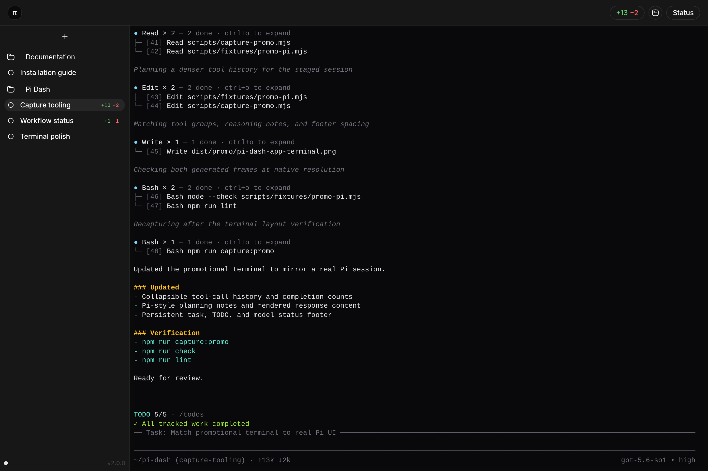

# Pi Dash

Pi Dash adds workspaces and worktree management around Pi agent.



## Requirements

Packaged Linux application:

- 64-bit glibc-based Linux with a graphical session
- Git
- Pi 0.83.0 or newer (configurable)
- `zenity` (preferred) or `kdialog` for native workspace selection

Source builds additionally require Node.js 24+, npm 11+, the native build prerequisites for `node-pty` (C/C++ toolchain and Python), and Chrome/Chromium for browser tests. Linux release packaging uses Podman or Docker to build native addons against the pinned compatibility baseline. The Nix development shell provides the source-build prerequisites except Pi and the optional Podman/Docker release builder.

## Nix

Enter the reproducible development environment, then install the locked npm dependencies:

```sh
nix develop
npm ci
```

Build or run the Nix desktop package directly:

```sh
nix build
nix run
```

The Nix package includes Git and Zenity but intentionally resolves `pi` from the user environment. Install Pi separately, for example with `pkgs.pi-coding-agent` in NixOS. See [Linux installation](docs/operations/install-linux.md) for `nix profile` and declarative NixOS examples.

## Commands

```sh
npm ci
npm run desktop      # build and launch Electron from the source tree
npm run package:linux # build the portable Linux x64 tarball
npm run verify:linux-artifact
npm run dev          # browser-based UI development only
npm run prod         # serve the SPA from Fastify for headless/testing use
npm run capture:promo # write staged terminal-only and diff-open screenshots
npm run db:migrate -- --data-dir "$(mktemp -d)"
npm run build
npm run lint
npm run check
npm test
npm run test:e2e
```

Use `npm run desktop` for interactive use from a source checkout. The desktop host removes browser accelerators and disables DevTools. Source launches use the system Node.js executable so native PTY/database modules retain their Node ABI; `PI_DASH_NODE_EXECUTABLE` may select another ABI-compatible Node.js 24+ executable.

The portable Linux artifact instead runs its daemon with a verified, bundled Node.js 24.18.0 runtime and a separately staged production dependency tree. It does not use `node` from `PATH`. See [Linux installation](docs/operations/install-linux.md).

The standalone daemon remains available for development and automation. It opens a short-lived, one-use launch URL in the default browser and also prints it as a fallback. Browser tabs cannot support every Pi keybinding; use the desktop application for terminal interaction. Do not share or persist the launch URL.

The promotional capture command builds the application, stages isolated demo repositories and terminal content, and writes two clean 2880×1920 PNGs: `dist/promo/pi-dash-app-terminal.png` and `dist/promo/pi-dash-app-diff.png`. Pass `--output-dir <path>` after `--` to choose another destination directory. It uses the first Google Chrome or Chromium executable on `PATH`; set `PLAYWRIGHT_CHROMIUM_EXECUTABLE_PATH` to select a specific executable.

Pi Dash is available under the [MIT License](LICENSE).

See [configuration](docs/operations/configuration.md), [terminal runtime](docs/operations/terminal-runtime.md), [terminal protocol](docs/architecture/terminal-protocol.md), [workflow status protocol](docs/architecture/status-protocol.md), [ask-user integration](docs/integrations/ask-user-status.md), [status troubleshooting](docs/operations/status-troubleshooting.md), [native directory dialog](docs/operations/native-directory-dialog.md), [local security](docs/operations/local-security.md), and [testing](docs/testing/README.md).
